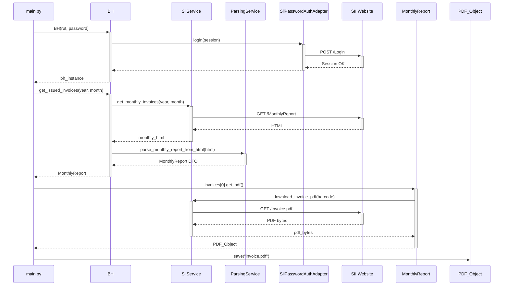

# BH: SII Fee Invoice Client

A Python library providing a programmatic interface to interact with the Chilean SII (Servicio de Impuestos Internos) for fee invoices (_boletas de honorarios_).

## Overview

This library simplifies the automation of common tasks related to fee invoices, such as fetching annual and monthly reports and downloading individual documents, through a clean, simple-to-use facade.

The project is designed following the principles of **Hexagonal Architecture** to ensure low coupling and high testability, isolating the core application logic from external services.

## Features

- **Automatic Login**: Handles authentication with the SII transparently.
- **Annual Reports**: Fetches annual summaries of issued fee invoices.
- **Monthly Reports**: Retrieves detailed monthly reports of issued invoices.
- **PDF Download**: Downloads individual invoice PDFs using their barcode.

## Installation

This project uses `uv` for dependency management.

1.  **Clone the repository:**

    ```bash
    git clone https://github.com/luisbarradev/BH-LIB
    cd BH
    ```

2.  **Create a virtual environment:**

    ```bash
    python -m venv .venv
    source .venv/bin/activate
    ```

3.  **Install dependencies:**
    ```bash
    uv pip install -e .
    ```
    _The `-e .` flag installs the project in "editable" mode._

## Configuration

The library requires your SII credentials to be available as environment variables.

1.  Create a `.env` file in the project root.
2.  Add your credentials to the file. You can use the `.env.example` as a template:

    ```dotenv
    # .env
    SII_RUT_NUM="12345678"
    SII_RUT_DV="9"
    SII_CLAVE="your_sii_password"
    ```

## Usage

The `BH` facade provides a simple entry point to all features.

### 1. Initialization

Instantiating the `BH` class automatically performs the login. The constructor reads the credentials from the environment variables loaded by `python-dotenv`.

```python
import os
from bh import BH
from datetime import datetime

# Credentials are read automatically from the .env file
# The RUT should be in the format "12345678-9"
rut = f''{os.getenv("SII_RUT_NUM")}-{os.getenv("SII_RUT_DV")}''
password = os.getenv("SII_CLAVE")

# Initialize the facade (performs login automatically)
bh = BH(rut=rut, password=password)
print("✅ Login successful!")
```

### 2. Get Annual Report

```python
current_year = datetime.now().year
annual_report = bh.get_issued_invoices(year=current_year)

print(f"Summary for {annual_report.year}:")
print(f"- Gross Income: ${annual_report.totals.gross_income:,.0f}")
print(f"- Invoices Issued: {annual_report.totals.issued_count}")
```

### 3. Get Monthly Report

```python
# Get report for January of the current year
monthly_report = bh.get_issued_invoices(year=current_year, month=1)

print(f"
Details for {monthly_report.month}/{monthly_report.year}:")
for invoice in monthly_report.invoices:
    print(f"  - N°{invoice.number}: ${invoice.total_amount:,.0f} to {invoice.recipient_name}")
```

### 4. Download an Invoice PDF

You can download the PDF for any invoice retrieved from a report.

```python
if monthly_report.invoices:
    first_invoice = monthly_report.invoices[0]

    print(f"
Downloading PDF for invoice N°{first_invoice.number}...")
    pdf = first_invoice.get_pdf()

    # Save the PDF to a file
    filename = f"invoice_{first_invoice.number}.pdf"
    pdf.save(filename)
    print(f"✅ PDF saved as '{filename}'")

    # You can also get the content in other formats
    pdf_bytes = pdf.get_bytes()
    pdf_base64 = pdf.get_base64()
```

## Running the Demo

The `src/main.py` file provides a complete demonstration of the library's capabilities. After configuring your `.env` file, you can run it using `uv`:

```bash
uv run python src/main.py
```

## Testing

The project uses `pytest` for testing. To run the test suite and generate a coverage report, execute the following command in the project root:

```bash
uv run pytest --cov=src
```

### Sequence Diagram

This diagram illustrates the call flow for fetching a monthly report and downloading a PDF.


